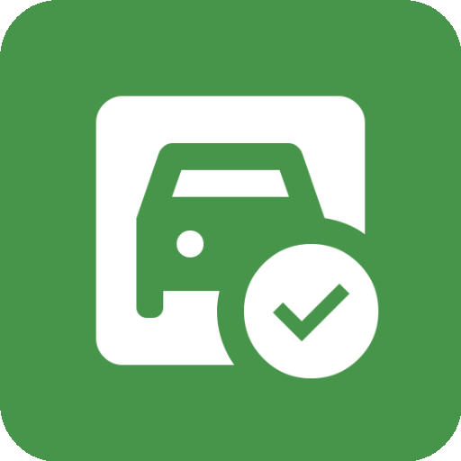
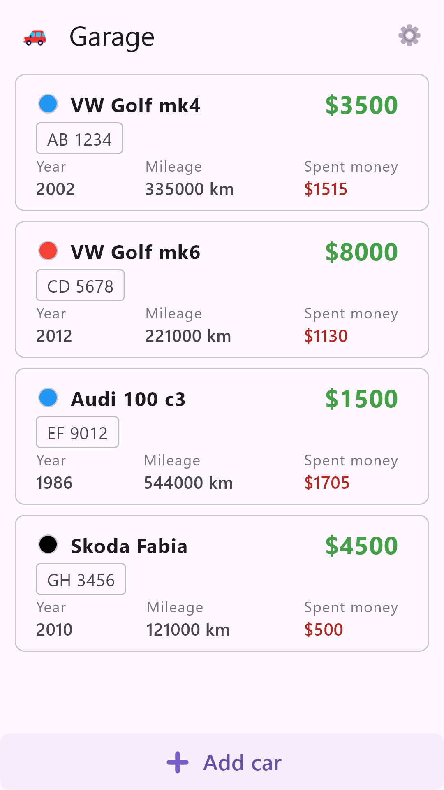
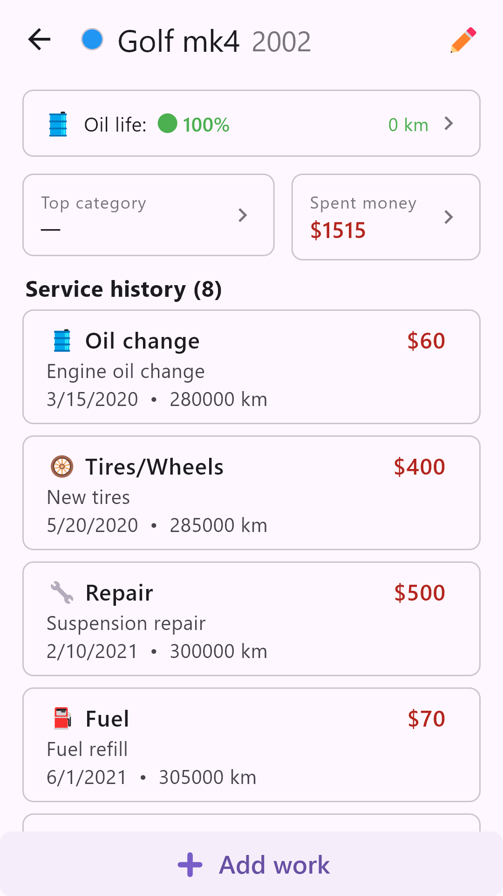
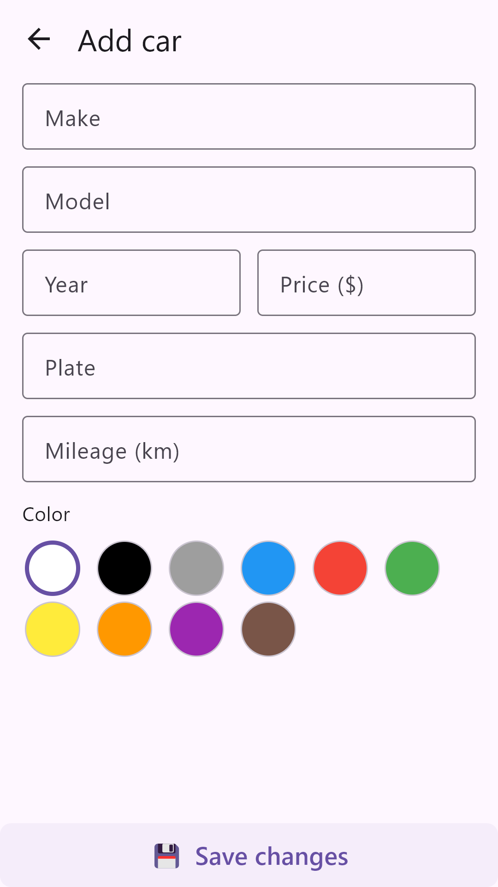
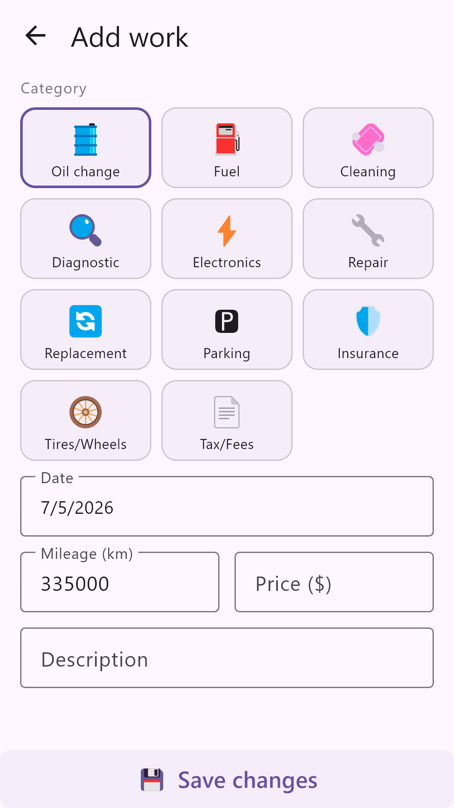
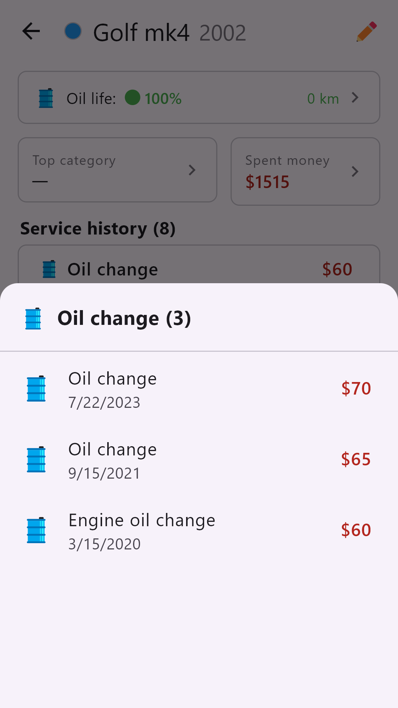
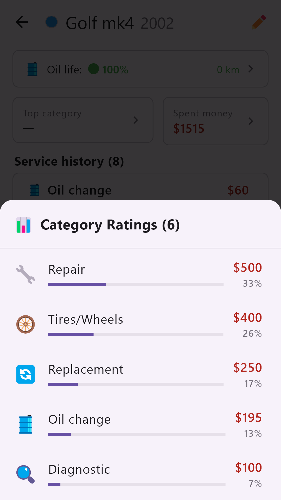
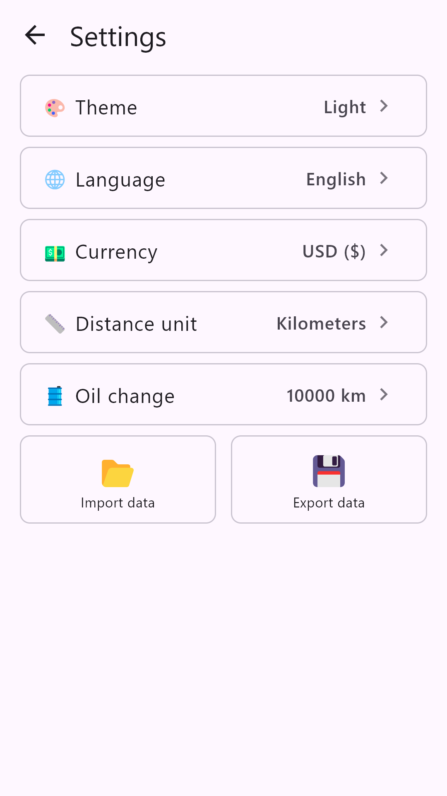

#  garage_app

Track maintenance, fuel, repairs and daily spending for your cars — all offline, in one place.

**Free · No ads · No tracking**

## Features

- **Garage management** — add, edit and remove cars with basic info, color, mileage and value.
- **Maintenance log** — record oil changes, repairs, fuel, tires, cleaning, insurance and more.
- **Spending overview** — see total money spent per car and top spending category at a glance.
- **Oil health** — monitor engine oil life based on mileage and your own service interval.
- **CSV import/export** — back up and restore your data, or seed the app with a CSV file.
- **Offline-first** — all data is stored locally on your device; no account or internet required.
- **Multi-language & currency** — supports several languages, distance units (km/mi) and currencies.

## Platforms

Flutter app. Supports **Windows** and **Android**. Other platforms may be added later.

## Screenshots

| Home | Car detail | Add car | Add car work |
|------|------------|---------|--------------|
|  |  |  |  |
| Your garage at a glance. | Service history and stats. | Add a new car. | Record maintenance or fuel. |

| Oil health | Category stats | Settings |
|------------|----------------|----------|
|  |  |  |
| Oil change history and engine oil life. | Spending breakdown by category. | Language, currency and units. |

## Developer resources

- [Developer guide](./DEV.md) — build, test and screenshot commands.
- [Guide for Agents](./AGENTS.md) — project architecture and conventions.
